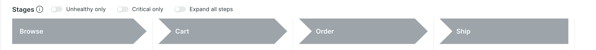
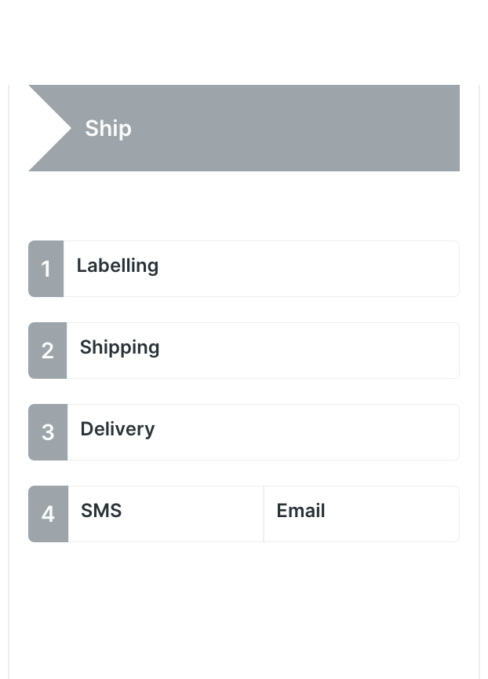
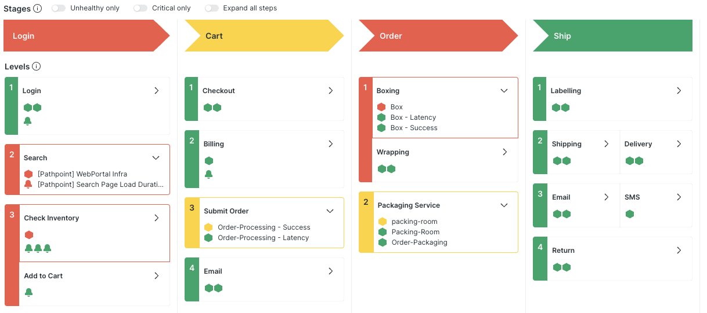
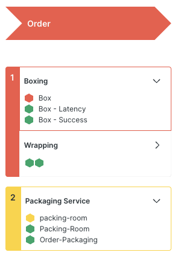
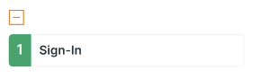

# Pathpoint Concepts

[Return to Main Index](index.md)

#### Concepts Topic

- [Flows](#Flows)
- [KPIs](#KPIs)
- [Stages](#Stages)
- [Steps (and Levels)](#Steps)
- [Signals](#Signals)
- [Health Indicators and Time Periods](#Health)
- [Access Permissions](#Access)

Pathpoint is intended to provide an aggregate model of business systems, representing the hierarchy of connected elements in a business process and providing an at-a-glance understanding of its health and attainment toward business objectives.

This notion of Pathpoint as an "aggregate" model is an important one: Pathpoint does not track individual transactions as they proceed through a business process. Rather, it focuses on the service delivery areas that are key to the execution of the process, and illustrates the overall health of those areas.

Each process model is constructed using multiple components in ascending order of complexity - from the top-level container of the model itself, to the underlying signals that convey health. Create and arrange these components in order to describe the key contributing systems, where in the process they impact, and the health characteristics of each.

In the following sections, we'll describe in depth each of the components that you will use to create a Pathpoint model, illustrating the concepts with a simple flow that models a very hypothetical retail business process.

Refer to the [Usage Guide](usage.md#how-to-create-and-edit) to learn how to create these components, although within each section below we'll link to the relevant how-to section if you would like to follow along.

## Flows

[Return to Index](#Pathpoint_Concepts) | [Usage: Create and Edit Flows](usage.md#how-to-flows)

The top level of a Pathpoint hierarchy is a Flow, which acts as the container for the entire model.

A Flow consists of two main components: KPIs and Stages.

- KPIs allow us to track performance metrics in the context of the Flow.
- Stages are the containers for functional groupings within the Flow, and are used to elaborate on the specifics required to execute that function.

We'll go into more detail on each of these in the next sections.

## KPIs

[Return to Index](#Pathpoint_Concepts) | [Usage: Create and Edit KPIs](usage.md#how-to-kpis)

KPIs are used to highlight the key indicators representing attainment toward the business goals of the Flow.

KPIs are defined using NRQL, and can capture any relevant key indicator, from foundational performance metrics (such as error response or throughput) to business measurements (such as orders shipped or new users signed up).

For our example Acme Telco Flow, we are going to include measures that describe the business success of the Flow, and also a couple of KPIs that let us understand the quality of the experience we are providing to our users.

Using KPIs in this way exposes the business objectives and outcomes of the Flow to the development and operational teams responsible for the service areas in the Flow. Connecting these indicators - and the trends that they expose - to the broader context of the Flow, can inform decision-making on where to focus investment and improve those outcomes.

With the Flow KPIs defined, we can move on to create the Stages.

## Stages

[Return to Index](#Pathpoint_Concepts) | [Usage: Create and Edit Stages](usage.md#how-to-stages)

A Flow will typically consist of 4-5 Stages (although there is no fixed limit), which combine to describe the major functional areas required for the business process to execute.

For instance, in our Acme Telco model, we have identified four major groupings that encapsulate the series of required service delivery functions. These are:

- Browse: where the customer interacts with our site to locate desired products and add them to the cart
- Cart: where the customer completes the checkout process
- Order: where we track the processes responsible for preparing the order
- Ship: where we track the processes responsible for order shipment and return

We have created a set of Stages in our Flow to represent each of these groupings:

The Stage headers include a directional indicator, telling us that this business process is initiated by interactions in the Browse Stage, then moves through the Cart and Order Stages, before concluding with the shipment of the order.

A Stage's shape can be adjusted to best reflect the role played by the Stage in the Flow. A Stage can be assigned one of four shapes:

- **Start**: Used to show the beginning of a process; typically used for the first Stage in a Flow.
- **Connector**: Used to show a Stage that must execute between two other Stages
- **Stop**: Used to show the end of a process; typically used for the final Stage in a Flow
- **None**: Used to show a set of processes that are required by the Flow, but aren't an outcome of the other Stages. For instance, there may be processes initiated by cron jobs, which execute outside the chain of interactions represented by connected Stages. In this case, you can model the Stage as "None" to show that it runs in isolation to the larger Flow.

A Stage further collects together the actions or events (known as Steps) that occur as the process progresses through the Stage. Let's move on to Steps to get a better understanding of the role they play in a Pathpoint model.

## Steps (and Levels)

[Return to Index](#Pathpoint_Concepts) | [Usage: Create and Edit Steps](usage.md#how-to-steps)

Steps are aggregate representations of specific service areas within a Stage, and contain the underlying data points that inform our understanding of the health of the Flow.

Steps are organized into Levels. Levels contain one or more Steps, and are numbered to represent the order in which they happen within the Stage. While a Level can consist of a single Step, you can also use Levels to group together Steps that may happen in parallel, or present different pathways through that Level in the Stage.

The Ship Stage of our example Flow illustrates these concepts well. Within this Stage we have identified the following Steps, organized into Levels:

- Level 1: The first thing that needs to execute in this Stage is the generation of the shipping Label
- Level 2: Once the Label is ready, we hand the package over to a shipping service provider
- Level 3: We track the package through to delivery to the customer
- Level 4: We notify the customer of completion through their channel of choice. Since we have two potential pathways through this Level, we have included two steps to represent handling for each channel: email or SMS.

With these additions, the Ship Stage now looks like this:

</a>

At this point, it's time to add some Signals, and start getting an understanding of the health of these different pieces of the Flow.

## Signals

[Return to Index](#Pathpoint_Concepts) | [Usage: Create and Edit Signals](usage.md#how-to-signals)

Signals are the foundational data points that inform our understanding of the health of the process overall.

A Signal can be any New Relic Entity or Alert Condition (for simplicity, we'll refer to these just as Alerts). Entities and Alerts have an inherent definition of health - this is what you see reflected throughout the New Relic platform. Pathpoint leverages these built-in health definitions, meaning there is no need to define specific thresholds or objectives within Pathpoint itself.

Once you have added the desired Signals, the Flow will automatically reflect the health of those signals, making it simple to isolate and investigate areas in the Flow that are experiencing problems.

With all the necessary Signals added to the Acme Telco Flow, we can tell at a glance where things are going wrong:

</a>

In the next section, we'll take a closer look at what these health indicators are telling us.

## Health Indicators and Time Periods

### Health Indicators

[Return to Index](#Pathpoint_Concepts)

The health indicators reported by Pathpoint are the same indicators you see anywhere else in the platform.

Fundamentally, health status in New Relic derives from alert definitions.
The status of an Alert itself obviously reflects whether or not its defined thresholds have been breached.
For Entities, their health status reflects the state of their connected Alerts - if there are no Alerts attached to an Entity, it effectively has an unknown health status, as Alerts define the parameters for what a healthy and unhealthy state mean for that Entity. (Service Levels are an exception to this rule: the status of a Service Level may also be set based on its compliance level, even if there are no alert definitions defined for the SLI.)

These health statuses come in four flavors:

- **Red**: this mean a critical incident is currently open on the Entity or Alert. In the case of Entities, the health status reflects the worst case. In other words, an Entity may be attached to one alert condition in critical state, and ten alert conditions that have no incidents open. In this case, even though the bulk of the attached alerts are fine, the Entity is colored Red.
- **Yellow**: a warning incident is currently open on the Entity or Alert, with no critical incidents open
- **Green**: there no active incidents for the Entity or Alert
- **Grey**: this can indicate two possible situations
  1. for both entities and alerts, grey can indicate that there is no data reporting (i.e. an unknown state)
  2. for entities, grey also indicates that no alert conditions have been defined for the entity (i.e. no health parameters defined)

Pathpoint evaluates the known state of each Signal against the health rules for its Step, and then propogates the worst health status up the model hierarchy:

- the Step is turned red or yellow based on its health rule definitions (see [Create and Edit Steps](usage.md#how-to-steps))
- if an underlying Step in a Level is red, that Level turns red (Steps can be excluded from the status health rolloup - see [Create and Edit Steps](usage.md#how-to-steps))
- if an underlying Level in a Stage is red, that Stage turns red

This is illustrated in the sample flow - if we look at the Order stage we see:

</a>

There are a couple of problems affecting the Stage: the `packing-room` service has an active warning incident, and the `Box` service has a critical incident. The status of each of these Signals is reflected in their Steps (`Boxing` is outline in red; `Packaging Service` is outlined in yellow) and is rolled up to their Levels (1 is red, and 2 is yellow). At the Stage level, the worse case takes precedence, and the Stage is colored red.

### Time Period

You may be wondering what time period the Pathpoint flow is showing. The answer is .. no time period. Pathpoint shows **current state**, meaning the current health status of its underlying Signals. In many parts of New Relic, a dynamic time picker is available to adjust the scope of time under consideration. Since Pathpoint reflects current health, this time picker has no meaning, and is not available.

In our sample Flow, the incident that has turned the `Box` Signal red was opened 24 hours ago. The warning incident affecting the `packing-room` service was opened 3 minutes ago. Because both incidents are still active, they are both surfaced in Pathpoint.

This holds true 100% of the time for entity-based signals. For alert-based signals, there is a caveat: the incident must have been opened in the **past 3 days** in order to be visible in Pathpoint. The 3 day limit is applied to ensure acceptable performance outcomes, but be aware that very long-lived alerts may not show up in Pathpoint (it should be noted that long-lived alerts are an anti-pattern - see [Manage Alert Quality](http://docs.newrelic.com/docs/tutorial-create-alerts/manage-alert-quality) for guidance on improving the quality and utility of your alert definitions.)

That said, the **Playback** feature allows you to review the historical state of a Flow - see [Revisit a period of time](usage.md#how-to-playback) for complete information on selecting the timeframes used in Playback. Since Playback does not look at current state, it also leverages the 3-day offset to capture any incidents that started at most 3 days prior to the start of the Playback window. For instance, if the Playback window is set to 10 AM - 11 AM, it will include any active incidents that started at most 3 days before 10AM.

The **KPI bar** also represents an exception to the "current state" handling of time period. Since KPIs are defined using standard NRQL, they have a time period baked into their definition. The KPI bar by default uses the time periods included the in the underlying NRQL statements, but also allows the time period affecting the bar to be changed using its built-in time picker dropdown.

## Access Permissions

Pathpoint is a New Relic [custom app](https://docs.newrelic.com/docs/new-relic-solutions/build-nr-ui/build-nr-app/) - this means it has some specific access and permission behaviours that may differ from the core product.

### App Access

Access to the Pathpoint app is managed through a combination of account access and license type:

- first, the app must be specifically enabled on individual accounts (or on a parent account, which automatically enables Pathpoint for all child accounts of the parent).
- second, if you are not using a compute-based license model, the Pathpoint app is only available to licensed (Core or Full) users in New Relic. Basic users will not be able to access Pathpoint.

Therefore, in order to access Pathpoint, a user must have access to the accounts on which it is enabled, and must be either on a compute license or a paid user license.

**Any user that passes these access requirements will have full READ and WRITE privileges within Pathpoint.**

### Data Access

Data access is best understood as the intersection of the user's individual account access permissions and Pathpoint's account access permissions.

Imagine a scenario where your organization has 10 accounts set up in New Relic. You as an individual have access to all 10. However, Pathpoint was only enabled on 2 of those accounts. In this case, the data available in Pathpoint will be limited to the 2 accounts on which it's enabled.

If we flip that scenario, and the user has access to 2 accounts but Pathpoint has access to all 10, the data will still be limited - _for that user_ - to their 2 accounts. If another user has access to 5 of the accounts, then they will be able to access data for all 5 accounts in Pathpoint, and so on.

Given that different users may have access to different data scopes, it is possible that a Pathpoint Flow may contain data from accounts you don't have access to - in these cases, an icon will be shown at the top of the Stage column to indicate that you are only seeing partial data within that Stage of the Flow.

---

 

Continue to the [How To Guide](usage.md#how-to-guide) for instructions on how to create and use a Pathpoint Flow.

[Return to Main Index](index.md)
