# How To Guide

[Return to Main Index](index.md)

#### Usage Topics

- [Getting Started](#getting-started)
- [Edit Mode](#how-to-edit)
  - [Create and Edit Flows](#how-to-flows)
  - [Create and Edit KPIs](#how-to-kpis)
  - [Create and Edit Stages](#how-to-stages)
  - [Create and Edit Steps (and Levels)](#how-to-steps)
  - [Select Signals](#how-to-signals)
- [View Mode](#view-mode)
  - [Investigate a Problem](#how-to-investigate)
  - [Revisit a period of time](#how-to-playback)
  - [Customize the View](#how-to-change-view)
  - [Audit a Change](#how-to-audit)
  - [Export a Flow](#how-to-export)
  - [Share a Flow](#how-to-share)
  - [Get Help](#how-to-get-help)

## Getting Started

When you first launch the Pathpoint app, you will be presented with a list of all the Flows that have been created in Pathpoint for the currently selected account. (If no Flows have yet been created for the account, you will be prompted to create a Flow - see [Create and Edit Flows](#how-to-flows))

To see Flows created for other accounts, change the active account by using the account dropdown at the top of the screen.

To view a Flow, click on the Flow's row in the table. This will open the Flow in View Mode, which shows the health status of the Flow. Refer to the [View Mode](#view-mode) section for more details on the features available in View Mode.

Proceed to the next section for details on how to create and edit a Flow.

## Edit Mode

Edit Mode is the mode you use to customize the Flow definition.

You can enter Edit mode by either clicking the `Create new flow` button, or by clicking the `Pencil` icon (to edit an existing Flow) - both are found in the upper right hand portion of the screen, above the title bar of the flow:

By and large, Edit Mode behaves the same regardless of whether you are creating a new Flow, or you are editing an existing one; unless indicated, the sections below are applicable to both create and edit.

### Create and Edit Flows

[Return to Index](#how-to-guide) | [Concepts: Flows](concepts.md#Flows)

#### Create a Flow

To create a new Flow, click on the `Create new flow` button in the upper right hand portion of the screen. This will open the Create Flow screen, which presents two options to create a new Flow: create a blank flow manually; or create a flow based on an existing configuration.

**Important Note:** The Flow will be created in the currently selected account; change the account by closing the Create Flow overlay, selecting the desired account using the account dropdown at the top of the screen, and reinitiating the Create Flow process. The account used during creation determines who is able to access it: any user with both access to the account and to Pathpoint will be able to see this Flow. Any user without access to the account will not see it. Note that this does not restrict the data that is shown in the Flow, as Pathpoint is able to show data across accounts. For more information on access permissions, see [Access and Permissions](concepts.md#access-permissions).

##### Create a Flow manually

Clicking on the **Blank Flow** option will initiate the process to manually define a Flow. Before starting on modeling out the structure of the Flow, you will need to define a couple of key properties:

- **Flow name** - The title that will be displayed on the Flow, and in the Flow listing page.

- **Refresh data every** - This is the interval at which a Flow will refresh its data. A Pathpoint Flow shows the current health state of its Signals (see [Health Indicators](concepts.md#Health)). When the Flow is first loaded, this represents the state of the Flow at the moment of loading, and it then will automatically refresh itself based on this interval. The default is to refresh every 1 minute.

Clicking the `Create` button will save a an empty Flow with these properties, and open Edit Mode. The additional sections in **Edit Mode** explain the specific configuration steps for each component in a Flow, starting with [creating a Stage](#create-and-edit-stages).

</a>

##### Create a Flow from an existing configuration

Clicking on the **Import** option in the Create Flow screen allows you to create a new Flow based on an existing JSON configuration. Choose the level of detail you want to import:

- **Structure only** - This will import only the structural definitions of a Flow (its Stages, Levels and Steps). This is quick way to copy a Flow shape without having to clean up the underlying Signals.

- **Everything** - This will import everything including Signals. Note that if you are importing a full config that includes Signals you don't have access to, those Signals will be included in the new Flow but you will not be able to see them - instead you will see the `Missing Signals` indicator at the top of the applicable Stages. Only a user with access to those Signals will see them and be able to edit their use in the Flow.

Once you have selected the level of detail to import, either drag and drop your JSON configuration file into the JSON input field, or copy/paste the JSON directly into the field.

If you need to change anything, you can manually edit the JSON directly in the screen.

Once you are ready, click the `Create` button, which will save the Flow and open it in Edit Mode for further updates.

#### Change Flow properties

To change the core properties of a Flow, select `Settings` from the `...` menu found in the upper right portion of the screen above the flow (this menu is available in both View and Edit mode).

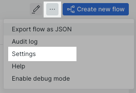

This will open the **Settings** side bar where you can adjust the Flow name, refresh rate, and the preferred layout for levels with multiple steps.

**Note:** To move the Flow to a different account, you will need to [export a copy](#how-to-export), re-import it via the steps described in **Create a Flow from an existing configuration** above, and then delete the original Flow.

#### Edit a Flow

To edit a Flow, click on the `Pencil` in the upper right portion of the screen while in View mode.

This will switch the Flow into Edit mode, which enables editing for all components in the Flow:

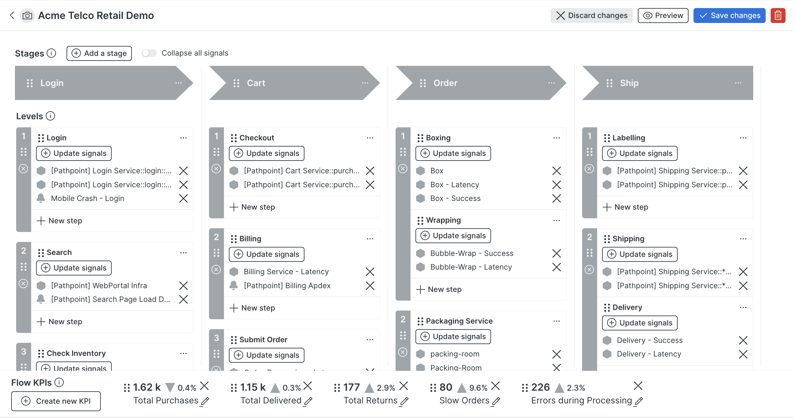

As you are making changes to the Flow, you can evaluate your progress without saving by using the `Preview` button. You can also choose `Discard changes` to return to View Mode using the previously saved state of the Flow.

When you are ready to save your changes, click `Save changes` to save your edits and return to View Mode.

When in Edit Mode, by default all elements of the Flow will be displayed. To help manage noise in the UI when editing a Flow, you can click the `Collapse all signals` toggle to hide the Signals and streamline the view to show only the Flow structure (Stages, Levels and Steps). The Signals will be hidden behind an expandable section in each Step - click on the `Show [x] signals` link to expand the Signals in an individual Step.

#### Delete a Flow

To delete a Flow, either:

1. In either View or Edit Mode, open `Settings` from the `...` menu and click on the Delete Flow button.
2. In View Mode, open Edit Mode by clicking the `Pencil` and click on the `Trash can` button in the upper right portion of the screen.

Deleting a Flow is permanent and cannot be undone.

### Create and Edit KPIs

[Return to Index](#how-to-guide) | [Concepts: KPIs](concepts.md#kpis)

To create a KPI, click on the `Create new KPI` button in the Flow KPIs bar located at the bottom of the screen.

To edit a KPI, click on the `Pencil` icon in the lower right-hand corner of the KPI you want edit.

To delete a KPI, click on the `X` icon in the upper right-hand corner of the KPI you want to delete.

To rearrange the order of the KPIs, click the `Drag` handle (the six dots to the left of the KPI value) of the KPI you want to move, and drag and drop it into the desired position.

When creating or editing a KPI, you will need to provide:

- `Title`: the name displayed underneath the KPI value if no Alias is provided
- `Alias`: an optional short-form of the title
- `Query`: the NRQL statement used to evaluate the KPI.

The account used for the Query will default to the currently selected account in the platform account picker. However, you can select any account that you have access to, and that is also enabled for Pathpoint. See [Access Permissions](concepts.md#access-permissions) for more information on data access rules.

The Query must return a single value, such as an **AVERAGE**, **COUNT** or **SUM**. It cannot include a **TIMESERIES** clause.

The Query can optionally include a **SINCE** clause. If no **SINCE** clause is provided, the default NRQL time period (1 hour) will applied to the query.

If you want the percentage change in the KPI to be displayed, include a **COMPARES WITH** clause in your query.

An example of a valid KPI query could be:
`FROM Transaction SELECT average(duration) SINCE 1 DAY AGO COMPARE WITH 1 WEEK AGO`

Click the Query `Preview` button to validate the query - if everything looks good, click either the `Add KPI` or `Save changes` button to continue.

**NOTE**: You must click the Preview button in order to apply any changes to the query.

### Create and Edit Stages

[Return to Index](#how-to-guide) | [Concepts: Stages](concepts.md#stages)

#### Create and Delete a Stage

To create a Stage, click the `Add Stage` button found below the Flow name. New Stages will be added to the end of the Flow.

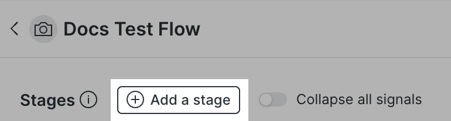

To delete a Stage, select **Delete stage** from the Stage's `...` menu.

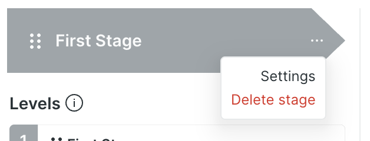

#### Rename the Stage

When you add a new Stage, the name will default to "New Stage". To rename the Stage, simply click on the current name of the Stage to enter edit mode for the field.

#### Add a logo

It may be helpful to add a logo to the Flow, to help associate it with a brand or with an internal team. To do so, click on the `Camera` icon next to the Flow name and enter the URL of the logo.

If you are having difficulty, it may be advisable to use a Data URI for the image instead of a URL pointing to the image.

#### Change position and shape

To move the Stage's position in the Flow, use the `Drag` handle (the six dots to the left of the Stage name) of the Stage you want to move, and drag and drop it into the desired position.

When a new Stage is added to the Flow, the shapes assigned to the Flow's Stages will be automatically adjusted to reflect their position in the sequence.

If you move the Stage after adding it, the shape will not automatically change - to adjust the shape, select **Settings** from the Stage's `...` menu, and choose the desired shape from the available list.

#### Add a link

You can add a link to the Stage to provide additional context - for instance, a dashboard in New Relic, or some knowledge base documentation. To add a link, select **Settings** from the Stage's `...` menu, and enter the link URL into the **Stage link** field.

### Create and Edit Steps (and Levels)

[Return to Index](#how-to-guide) | [Concepts: Steps (and Levels)](concepts.md#steps-and-levels)

#### Add Levels and Steps

To add a Level, click on the `Add Level` button, found below the last Level in the Stage. As you add Levels, their number will automatically increment to represent their current position in the Stage.

Once a Level has been added, you can now add a Step. Click the `Add a step` button in the Level.

To add an additional Step to the same Level, click the `New step` button at the bottom of the Level.

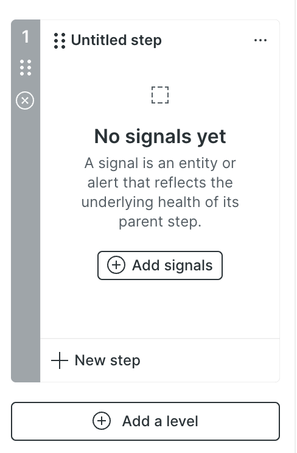

#### Delete Levels and Steps

To delete a Level, click on the `x` icon found below the Level's Drag handles.

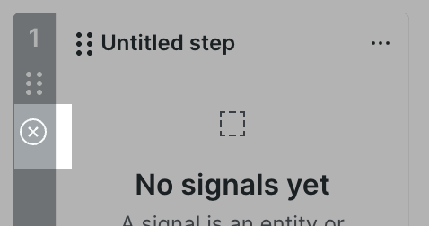

To delete a Step, select **Delete step** from the Step's `...` menu.

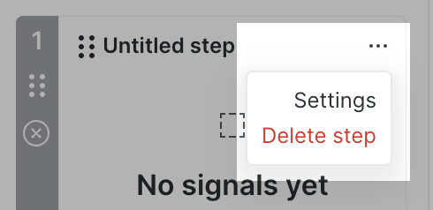

#### Rename a Step

The Step name will default to "Untitled step" - to change it, simply click on the Step name to enter edit mode for the field.

#### Add a link to a Step

You can add a link to a Step to provide additional context - for instance, a dashboard in New Relic, or some knowledge base documentation. To add a link, select **Settings** from the Step's `...` menu, and enter the link URL into the **Step link** field.

#### Adjust a Step's status health rules

The health status shown in the View Mode of a Flow is based on the various Signals included in the Steps, as outlined in [Concepts: Health Indicators](concepts.md#health-indicators).

The Signals collected in a Step roll up to impact its health status. By default, the Step health will be determined by the worst status among its collection of Signals. For instance, if a Step contains 10 Signals, and one of those Signals is red but the rest are green, the Step health will be red.

You can adjust this behavior in the **Status Configuration** in the Step's **Settings** (found in the `...` menu).

The configuration options provide a lot of flexibility in how the Signals combine to determine the Step health:

- which Signals will contribute to the Step's health status
- whether the worst status of the included Signals will determine the Step health status, and if a certain threshold (count or percentage) of included Signals must be reached to change the Step health status
- whether the best status of the included Signals will determine the Step health status

By default, a Step's health status will roll up to the Level status, and on up the tree to the Stage. However, you can choose to exclude the Step from affecting the status hierarchy by checking the **Exclude Step from Level Status** checkbox. The Step will still display its health as determined by the Signal configuration, but it will not contribute to the aggregated status of its Level or its Stage.

For instance: imagine you have a Level with two Steps. Step A is configured to be excluded from the Level status, and Step B is configured to contribute to the Level status. If Step A is red and Step B is green, the Level status will be green, and it will report a status of green up to its Stage:

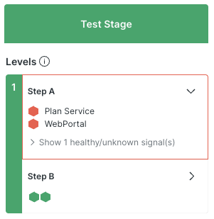

#### Move Levels and Steps

As with Stages and KPIs, you can move a Level or Step by clicking on the `Drag` handle (the six dots) and dragging and dropping the Level or Step to the desired location in the Stage. If you move a Level, it will automatically be renumbered to reflect its position in the Stage.

**Note**: You cannot move Levels and Steps between Stages, only within their current Stage.

### Select Signals

[Return to Index](#how-to-guide) | [Concepts: Signals](concepts.md#signals)

Signal membership in a Step is managed in the **Select signals** overlay. To enter this overlay, click either the `Add signals` or `Update signals` button in the Flow Edit mode.

Once opened, you will be presented with the set of Entities and Alert Conditions available for selection.

By default, you will start on the Entities tab, with the Signals list pre-filtered to APM (Services) entities belonging to the active account. Change the Signals listed by changing the account, the entity type, or by filtering the list by entity name (or Condition/Policy name in the Alerts tab).

Click the checkbox next the desired Signal in the table to add it to the **Selected signals** list on the right side of the screen. To remove a Signal, either uncheck it in the table, or click on the `x` icon next to the Signal in the **Select signals** list.

You can choose a maximum of 25 entities and 25 alerts for a single Step.

If you need to exceed the 25 entity limit, we recommend collecting those entities into a Workload, and adding the Workload as the Signal to the Step.

## View Mode

View Mode shows the active health status of the Flow, and is designed to make it simple to identify the areas experiencing issues in the Flow. The KPI bar at the bottom of the Flow reflects the behaviour of the key business measures, enabling you to assess the impact of the Flow performance on these critical outcomes.

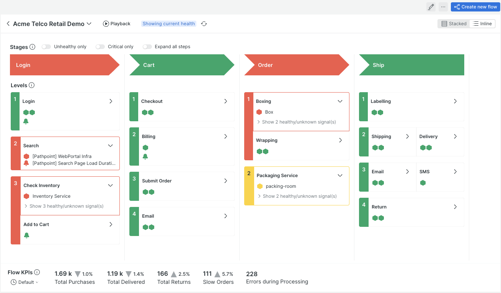

The following sections will cover the additional features and capabilities available within View Mode.

### Investigate a Problem

[Return to Index](#how-to-guide)

With Pathpoint, it is very easy to isolate problem areas in you broader business process. As Signals experience problems, represented in the New Relic platform as incidents, their status in the Flow is updates to reflect the severity of the problem (see [Concepts: Health Indicators](concepts.md#health-indicators) for more information). By collecting Signals into meaningful categories (Stages and Steps), you are able to evaluate the potential importance of the problem, with the status configuration allowing further refinement on how incidents are understood to impact on the process overall (see **Adjust a Step's status health rules** in [Create and Edit Steps (and Levels)](#create-and-edit-steps-and-levels)).

If there is a problem that requires further action, Pathpoint helps kick-start investigation by incorporating key data points into the Signal detail panel, accessible by clicking on a Signal in the Flow.

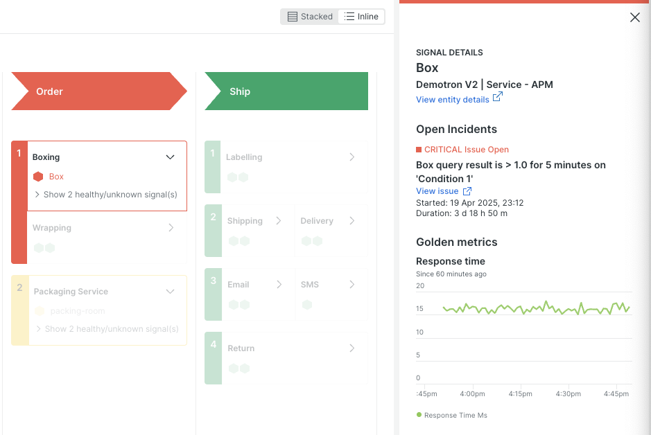

The Signal detail panel shows you immediately what incident condition is impacting that Signal. You can drill down further into the specifics of the issue by clicking on the `View issue` link, which gives you rapid access to New Relic's comprehensive Issue overview.

For entities, you will also be able to review the entity's Golden Signals, which may provide some immediate indication of where the problem is manifesting. If more information is needed, you can drill into the entity-specific view by clicking on the `View entity details` link, which will open New Relic's highly detailed, curated view for that entity.

By surfacing these details and jumping-off points into other parts of the platform, Pathpoint simplifies problem identification and drives to next steps in an investigation very quickly.

Can also combine these features with Playback mode (see [Revisit a period of time](#how-to-playback)) to investigate an event that occurred in the past.

### Revisit a period of time

[Return to Index](#how-to-guide)

View mode of a Pathpoint Flow shows the current health status of its Signals (see [Health Indicators](concepts.md#health-indicators)). In order to see a previous window of time, you can use **Playback** mode.

Enter Playback mode by clicking on the `Playback` button located at the top of the Flow, next the to Flow title.

Playback uses two concepts of time:

1. Playback window: the playback window represents the entire period under consideration. By default, the window is set to the previous 30 minutes.
2. Playback increments: the playback window is broken into discrete segments of time, called increments. Increments are plotted onto a playback bar (more on this below). The size of the increment is correlated to the duration of the playback window. By default, the increment is set to 1 minute.

Using these two concepts, Playback allows you to assess how the state of the Flow changed over a period. Rather than showing the aggregate state of the Flow for the entire duration, it breaks it down into small time increments and allows you to understand how the Flow changed over that window of time. Using Playback, you can observe the effects of an incident on the Flow overall, including the behaviour of the Flow leading up to the incident, and how the incident may have impacted throughout the Flow over time.

When you enter Playback mode, things will look pretty much the same as View mode, except you will see the playback bar and configuration options displayed directly above the Stages of the Flow.

The image above represents the default state for Playback, showing the previous 30 minutes broken up into 1 minute increments, with the first increment selected. The selected time increment is outlined in black in the playback bar, with the time range represented by the increment shown directly above the bar (in this case, the first increment maps to 14:02-14:03 on May 5). Each increment in the bar is colored to show the aggregate status for the Flow in that window of time: if any Stage was red during the increment time range, the increment will be colored red. The Flow itself is showing its health status during the selected time increment. The KPI bar is updated to match the playback window (30 minutes).

Click the `Play` button located directly to the left of the playback bar to automatically cycle through the time increments - the status of the Flow will update as the playhead progresses. You can pause the playback at any time by clicking the `Pause` button.

To drill directly into a specific segement, simply click on the desired segement to view the status of the Flow at that moment in time.

The playback bar has several configuration options:

1. Adjust the playback window using the dropdown to the left of the Playback bar. The dropdown offers several convenient presets, as well as allowing you to set a custom window. The maximum period of time that can be shown is 7 days. When this value is changed, the KPI bar is also updated to use the new window.
2. Change the duration of the increment by adjusting the **Playhead increment**. This setting is located in the configuration menu found by clicking the `gear` icon to the left of the playback bar. The increments are set by default based on the length of the playback window: a 30 minute window defaults to 1 minutes increments; a 7 day window defaults to 60 minute increments; etc. Shorter increments will not be available for longer playback windows.
3. Set the playback to continuously loop by clicking the **Loop** option found in the configuration menu. The Playback will cycle until Loop is unchecked or until the `Pause` button is clicked.

To return to View mode, click the `Exit playback` button.

### Customize the view

[Return to Index](#how-to-guide)

View mode provides a few configuration options to tweak the display to meet your needs - these options are available when in Playback as well:

- [Layouts](#layouts)
- [Display toggles](#toggles)

#### Layouts

First, at the top of the Flow on the right-hand side, you will be able to choose between two layout options: `Inline` and `Stacked`.

**Inline**

The Inline layout is selected by default, and presents the Signals in-context with their Steps, making it simple to understand the impact of the Signals on the Flow.

The Inline layout uses a couple of tactics to help manage noise in the display, and allow you to focus on problem areas in the Flow:

1. The Signals in Steps that are healthy will be automatically compressed into a set of icons. A hex icon is used to signify and Entity type Signal, a bell icon is used to signify an Alert Condition Signal.
2. Steps that are in an unhealthy state are automatically expanded to show the listing of the unhealthy Signals. The healthy or unknown (meaning we have no health status associated with them) Signals in an unhealthy Step are hidden in an expandable section in the Step, labeled "Show x healthy/unknown signals". Click the label to expand the section and show all Signals attached to the Step.

Click on a Step title to open the Step panel, which details the rules that determine the Step's health status.

Click on a Signal to open the Signal detail panel, and highlight all Steps that Signal is attached to.

**Stacked**

The Stacked layout places greater emphasis on the structure of the Flow, offering a streamlined perspective of the Steps, with the Signals collected into a column below. Any Signals experiencing issues will bubble to the top of the column.

Here is the Flow in the same state as above, but displayed in the Stacked layout:

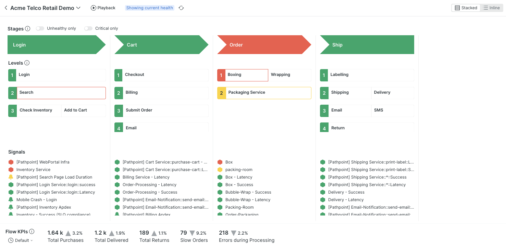

To identify which Signals belong to a Step, click on the Step - the associated Signals will bubble to the top of the Signals column, and the Step details panel will be displayed.

To see the details of a Signal, click on the Signal in the Signals column. The Step(s) that Signal belongs to will be highlighted, and the Signal details panel will be displayed.

#### Display toggles

In addition to the default layout behaviour described above, there are some additional toggles provided to help fine tune the presentation. These toggles are located at the top of the Flow, right above the Stages.

**Unhealthy only**: Toggle this to eliminate any healthy Steps and Signals from the display. Only warning and critical Steps and Signals will be visible in the Flow.Note that if a Step has been excluded from the rollup health calculation, it will be hidden even if it is in a warning or critical state. This is helpful if you need to streamline the view to include only to those elements that are degrading the state of the Flow.

**Critical only**: Toggle this to show only the elements of the Flow that are in a critical state. Note that if a Step has been excluded from the rollup health calculation, it will be hidden even if it is in a critical state. This is helpful if you need to streamline the view down only to those elements that are degrading the state of the Flow.

**Expand all steps**: This toggle is available only in the Inline layout. Clicking it will expand all Steps in the Flow to show their full Signal listings.

### Audit a change

[Return to Index](#how-to-guide)

Pathpoint provides a very basic audit log to help you understand who made changes to the Flow, and when. At this time, details of the changes are not included in the log.

Open the audit log by selecting **Audit log** from the `...` menu.

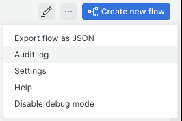

### Export a Flow

[Return to Index](#how-to-guide)

A Flow configuration is stored as a JSON object in a storage space accessible only by the application.

In order to share, backup or version control your Flow configuration, you will need to export the underlying JSON. You can do so by selecting the **Export flow as JSON** menu option under the `...` menu at the top of the screen.

Selecting this option will open the **Epxort flow** modal. Click the `Download` button to generate a file containg the JSON configuration on your local system.

If there is an issue with the file generation, the modal also provides the entire JSON configuration as text, which you can simply copy and paster into a file manually.

###  Share a Flow

[Return to Index](#how-to-guide)

If you need share the Flow with others, use the platform `Copy Permalink` button at the top of the screen. Remember that only users with appropriate access levels will be able to view the Flow.

This will create a shareable URL of the Flow, including the following configuration options:

- layout (stacked or inline)
- active toggles (unhealthy only, critical only, expand all steps)

If you create a permalink while in Playback mode, the permalink will additionally include the following configuration options:

- playback window
- playhead increment

### Get Help

[Return to Index](#how-to-guide)

As Pathpoint is an open source add-on to the platform, it is not subject to the same support process as the core New Relic platform.

To get assistance, you will need to open an issue or a discussion question in the public Github repository. To simplify this process, links to the repository are provided directly in the app.

Click **Help** in the `...` menu to open the Help modal.

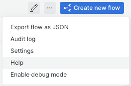

The Help modal includes direct links to this documentation, and to the forms to report a bug, reqeust a feature, or to ask a question.

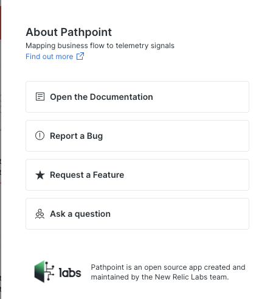

The Labs team actively monitors the Github repository for these submissions and will respond to you as soon as possible.

#### Debug Mode

When reporting a bug, the more context you can provide, the better.

This is slightly more advanced, but if you are comfortable with these steps, it is extremely helpful to include log output to assist with troubleshooting.

To generate verbose log output, select **Enabled debug mode** in the `...` menu.

With debug mode enabled, recreate the bug condition you need to report and then open the browser log console by right-clicking anywhere in the screen and selecting "Inspect" from the context menu.

This will open a special section in the browser that contains useful information - here's what it looks like in Chrome, but all browsers are essentially the same. You can see a set of tab along the top of this section - we are interested in the **Console** tab.

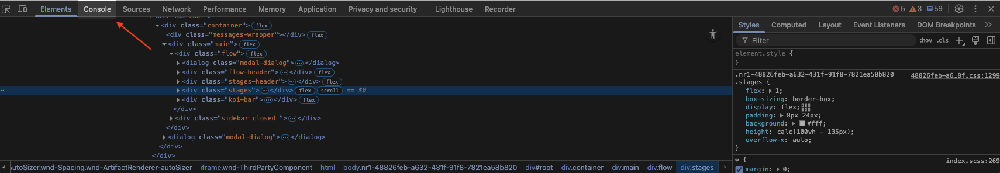

Clicking on the **Console** tab will open the view that contains the log output. At this point, look for errors that have been recorded into the log, which are higlighted in red. Take one or more screenshots of the log sections that include the errors, and add them to your bug report.

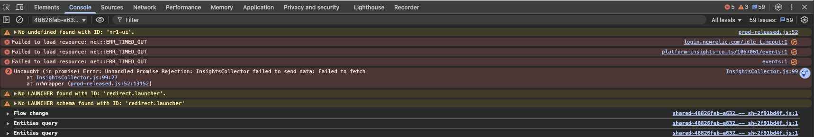

Once your bug report is submitted, you can feel free to disable debug mode again via the `...` menu.
